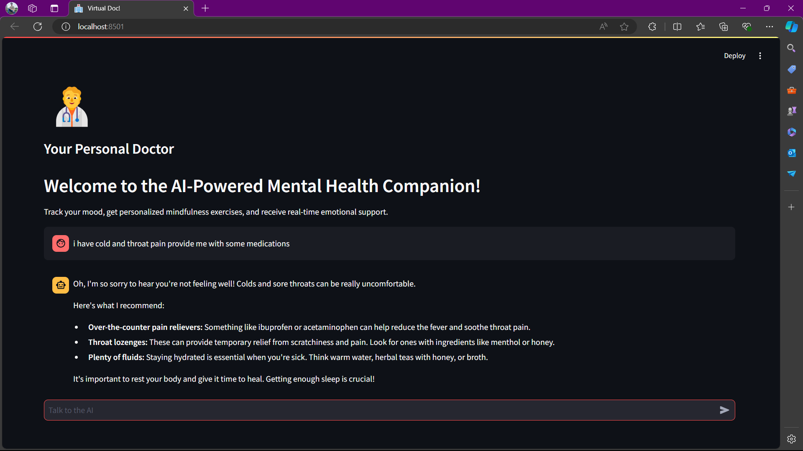

# AI Triage Assistant

This repository contains the code to run an AI-powered assistant to provide medical advice, answer patient queries, and triage symptoms, enhancing patient engagement and care.


## Preview


## Overview

This Streamlit application focuses providing patients with medical advice, answer patient queries, and triage symptoms, enhancing patient engagement with care using a virtual triage assistant.
Created for the ENG 2PX3 Sprint 3 Project.

## Project Structure

The project is structured as follows:

- `app.py`: Application to run the triage assistant.
- `requirements.txt`: File containing the necessary dependencies to run the project.


## Getting Started

To get started with the project, follow these steps:

1. Clone this repository to your local machine.
    ```bash
    git clone https://github.com/xuej41/AI-Triage-Assistant.git
    cd AI-Triage-Assistant
2. Install the required dependencies using 
    ```bash
    pip install -r requirements.txt
3. If you get an error involving `dotenv` not being found, run the following command in your terminal:
    ```bash
    python -m pip install python-dotenv
3. Head to https://groq.com/groqcloud/, login or make an account, and obtain your API key.
4. Create a `.env` file and paste the line `API_KEY='Your API key here'` (replace Your API key here with your API key).

## Usage

- **Application**:  To start the application and use the virtual triage assistant execute the following command:
    ```bash
    streamlit run app.py

After running the command, navigate to http://localhost:8501/ in your web browser to access the application.

<!--

## Docker Setup

To containerize the application and run it using Docker, follow these steps:

1. Build the Docker image:
    ```sh
    docker build -t virtual_doc-app .
    ```
2. Run the Docker container:
    ```sh
    docker run -p 8051:8051 virtual_doc-app
    ```
3. Access the web interface at http://localhost:8501/. -->

